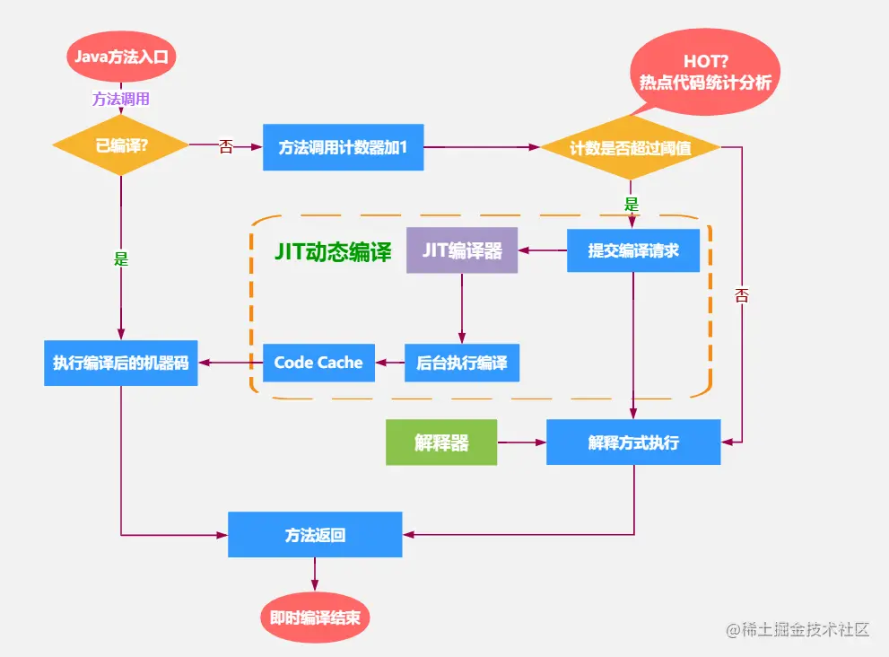

# JMH

JMH,*全称 Java Microbenchmark Harness (微基准测试框架)*,是专门用于Java代码微基准测试的一套测试工具API,是由 OpenJDK/Oracle 官方发布的工具。精度可以精确到微秒级。

## 一、依赖

```java
<dependency>
	<groupId>org.openjdk.jmh</groupId>
	<artifactId>jmh-core</artifactId>
	<version>1.33</version>
</dependency>

<dependency>
	<groupId>org.openjdk.jmh</groupId>
	<artifactId>jmh-generator-annprocess</artifactId>
	<version>1.33</version>
	<scope>provided</scope>
</dependency>
```

## 二、注解

### @BenchmarkMode

Mode 表示 JMH 进行 Benchmark 时所使用的模式。通常是测量的维度不同，或是测量的方式不同。目前 JMH 共有四种模式：

1. Throughput: 整体吞吐量，例如“1秒内可以执行多少次调用”，单位是操作数/时间。
2. AverageTime: 调用的平均时间，例如“每次调用平均耗时xxx毫秒”，单位是时间/操作数。
3. SampleTime: 随机取样，最后输出取样结果的分布，例如“99%的调用在xxx毫秒以内，99.99%的调用在xxx毫秒以内”
4. SingleShotTime: 以上模式都是默认一次 iteration 是 1s，唯有 SingleShotTime 是只运行一次。往往同时把 warmup 次数设为0，用于测试冷启动时的性能。

### @OutputTimeUnit

输出的时间单位。

### @State

类注解，JMH测试类必须使用 @State 注解，它定义了一个类实例的生命周期，可以类比 Spring Bean 的 Scope。由于 JMH 允许多线程同时执行测试，不同的选项含义如下：

1. Scope.Thread：默认的 State，每个测试线程分配一个实例；
2. Scope.Benchmark：所有测试线程共享一个实例，用于测试有状态实例在多线程共享下的性能；
3. Scope.Group：每个线程组共享一个实例；

### @Fork

进行 fork 的次数。如果 fork 数是2的话，则 JMH 会 fork 出两个进程来进行测试。

注：在springboot中，一定要设成0，benchmark和启动方法在同一个jvm中执行

### @WarmUp

Warmup 是指在实际进行 Benchmark 前先进行预热的行为。

为什么需要预热？因为 JVM 的 JIT 机制的存在，如果某个函数被调用多次之后，JVM 会尝试将其编译成为机器码从而提高执行速度。为了让 Benchmark 的结果更加接近真实情况就需要进行预热。

如果熟悉JVM类加载机制的话，应该知道JVM默认的执行模式是JIT编译与解释混合执行。JVM通过热点代码统计分析，识别高频方法的调用、循环体、公共模块等，基于JIT动态编译技术，会将热点代码转换成机器码，直接交给CPU执行。

![img]

### @Meansurement

提供真正的测试阶段参数。指定迭代的次数，每次迭代的运行时间和每次迭代测试调用的数量。

### @Benchmark

方法注解，表示该方法是需要进行 benchmark 的对象。

### @Setup

方法注解，会在执行 benchmark 之前被执行，正如其名，主要用于初始化。

### @TearDown

方法注解，与@Setup 相对的，会在所有 benchmark 执行结束以后执行，主要用于资源的回收等。

### @Iteration

Iteration 是 JMH 进行测试的最小单位。在大部分模式下，一次 iteration 代表的是一秒，JMH 会在这一秒内不断调用需要 Benchmark 的方法，然后根据模式对其采样，计算吞吐量，计算平均执行时间等。

